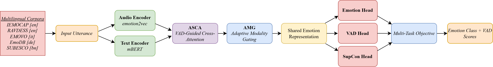

# Multilingual VAD-Guided Speech Emotion Recognition (SER)

A joint multilingual, multimodal Speech Emotion Recognition (SER) system trained simultaneously on five corpora spanning four languages. The model fuses audio representations from `emotion2vec` with multilingual text embeddings from `mBERT`, guided by a novel VAD-aware cross-modal attention mechanism and optimized with a multi-task training objective.

---

## 🌟 Key Features

- **Joint Multilingual Training**: Single model trained on IEMOCAP (English), RAVDESS (English), EmoDB (German), EMOVO (Italian), and SUBESCO (Bangla) under a unified 6-class emotion taxonomy.
- **Multimodal Fusion**: Fuses `emotion2vec_plus_large` audio features (1024-dim) with `bert-base-multilingual-cased` text features (768-dim).
- **Novel Components**:
  - **Affect Space Cross-Attention (ASCA)**: VAD-guided bidirectional cross-attention that grounds multimodal fusion in psychological emotion theory.
  - **Adaptive Modality Gating (AMG)**: Per-sample dynamic weighting of audio vs. text modalities based on emotion-discriminative confidence.
  - **Cross-Modal Alignment Loss (CMAL)**: Supervised contrastive objective enforcing shared emotion representations across modalities and languages.
- **Multi-task Objective**: Combines Focal Loss (class imbalance), VAD auxiliary regression, and CMAL (SupCon).
- **Stable Training**: Auxiliary losses reduce run-to-run variance by **2.6×** compared to a focal-only baseline.

---

## 📁 Repository Structure

```
.
├── main.py                      # Main joint training script (5 datasets, 5-run evaluation)
├── inference.py                 # Single-file inference with emotion + VAD output
├── evaluate_metrics.py          # Evaluation: WA, UA, Macro-F1, WF1 (zero-support excluded)
├── models/
│   └── novel_components.py      # ASCA, AMG, CMAL implementations
├── processing/                  # Feature extraction scripts per dataset
│   ├── process_iemocap_common6.py
│   ├── process_emodb.py
│   ├── process_emovo.py
│   ├── process_ravdess.py
│   └── process_subesco.py
├── feature extraction/          # Legacy per-dataset extraction scripts
├── comparison/                  # Comparison data and scripts
├── metadata/                    # CSV files: audio_file, raw_text, label, speaker_id [gitignored]
├── results/                     # JSON results from multi-run evaluations [gitignored]
├── arch.png             # Model architecture diagram
└── requirements.txt
```

---

## 🚀 Installation

1. **Clone the repository:**
   ```bash
   git clone https://github.com/gshyamv/Multilingual-VAD-Guided-SER.git
   cd Multilingual-VAD-Guided-SER
   ```

2. **Install dependencies:**
   ```bash
   pip install torch torchvision torchaudio --index-url https://download.pytorch.org/whl/cu118
   pip install transformers librosa soundfile scikit-learn numpy funasr pymupdf
   ```

---

## 🛠️ Data Preparation

Extract features for each dataset using scripts in `processing/`:

```bash
python processing/process_emodb.py   --root_dir /path/to/EmoDB   --output_dir features_common_6
python processing/process_iemocap_common6.py --root_dir /path/to/IEMOCAP --output_dir features_common_6
python processing/process_emovo.py   --root_dir /path/to/EMOVO   --output_dir features_common_6
python processing/process_ravdess.py --root_dir /path/to/RAVDESS --output_dir features_common_6
python processing/process_subesco.py --root_dir /path/to/SUBESCO --output_dir features_common_6
```

Each script outputs `.pkl` files containing `(audio_feat, text_feat, label, speaker_id)` tuples.

---

## 🏃 Usage

### Training (Joint Multilingual)

```bash
python main.py \
  --train features_common_6/IEMOCAP_train.pkl features_common_6/EmoDB_train.pkl \
          features_common_6/EMOVO_train.pkl features_common_6/RAVDESS_train.pkl \
          features_common_6/SUBESCO_train.pkl \
  --val   features_common_6/IEMOCAP_val.pkl features_common_6/EmoDB_val.pkl \
          features_common_6/EMOVO_val.pkl features_common_6/RAVDESS_val.pkl \
          features_common_6/SUBESCO_val.pkl \
  --epochs 100 --batch_size 32 --num_runs 5 --output results/joint_results.json
```

### Inference

```bash
python inference.py --audio path/to/audio.wav --text "The corresponding transcript"
```
Outputs: predicted emotion label, confidence score, and VAD (Valence, Arousal, Dominance) estimates.

---

## 📊 Model Architecture



| Stage | Component | Detail |
|---|---|---|
| Feature Extraction | emotion2vec | Audio → 1024-dim |
| Feature Extraction | mBERT | Text → 768-dim |
| Projection | Linear + LayerNorm | Both → `hidden_dim` |
| Cross-Modal Fusion | ASCA (novel) | VAD-guided bidirectional attention |
| Fusion | AMG (novel) | Per-sample modality gating |
| Auxiliary Loss | CMAL (novel) | Supervised cross-modal contrastive |
| Task Heads | Classifier + VAD head | 6-class emotion + VAD regression |

---

## 📈 Experimental Results

> All results use the **Common-6 emotion set**: Anger, Sadness, Happiness, Neutral, Fear, Disgust.  
> Macro-F1 **excludes zero-support classes**. Val UA reported as **Mean ± Std across 5 runs**.

### Joint Multilingual Model — Per-Dataset (best run)

| Dataset | Language | WA | UA | Macro-F1 |
|---|---|---|---|---|
| IEMOCAP | English | 77.18% | 67.28% | 66.64% |
| EmoDB | German | 96.49% | 96.10% | 96.54% |
| EMOVO | Italian | 69.05% | 69.05% | 65.22% |
| SUBESCO | Bangla | 59.00% | 59.00% | 58.96% |
| RAVDESS | English (acted) | 78.41% | 79.17% | 78.75% |
| **Global (pooled)** | Multilingual | **69.83%** | **66.16%** | **65.51%** |

**Val UA (5 runs): 81.72% ± 0.27%**

### Joint vs. Per-Dataset Baseline

| Dataset | Per-Dataset WA | Joint WA | Δ |
|---|---|---|---|
| IEMOCAP | 78.10% | 77.18% | −0.92% |
| EmoDB | 100.00% | 96.49% | −3.51% |
| EMOVO | 82.14% | 69.05% | −13.09% |
| SUBESCO | 58.58% | **59.00%** | **+0.42%** ✅ |
| RAVDESS | 77.27% | **78.41%** | **+1.14%** ✅ |

### Ablation — Loss Component Contributions

| Configuration | Val UA (5-run) | Test WA | Macro-F1 |
|---|---|---|---|
| Focal Loss only | 81.54% ± 0.69% | 68.78% | 64.32% |
| + VAD only | 81.68% ± 0.29% | **71.11%** | **66.33%** |
| + CMAL only | 81.79% ± 0.28% | 69.86% | 65.50% |
| **Full (VAD + CMAL)** | **81.72% ± 0.27%** | 69.83% | 65.51% |

### Comparison with Published Baselines

| Method | Year | Modality | IEMOCAP WA | EmoDB WA | RAVDESS WA |
|---|---|---|---|---|---|
| GM-TCNet | 2022 | Audio | — | 90.17% | 87.35% |
| TIM-Net | 2023 | Audio | 71.65% | 94.67% | 92.08% |
| EmoFusioNet | 2025 | Audio | 79.30% | 99.63% | 99.02% |
| **Ours (Joint)** | 2026 | Audio+Text | **77.18%** | **96.49%** | **78.41%** |

---

## 🧪 Novelty Summary

1. **ASCA** — Affect Space Cross-Attention: VAD-distance-based affinity matrix guides cross-modal attention.
2. **AMG** — Adaptive Modality Gating: Sigmoid gate over `[h_t; h_a; h_t⊙h_a]` selects per-sample modality weights.
3. **CMAL** — Cross-Modal Alignment Loss: Symmetric InfoNCE between text and audio embeddings, with same-emotion bonus term.
4. **VAD Auxiliary Supervision** — Acts as a class-balance regularizer, improving UA on minority emotion classes (e.g., +2.41% on IEMOCAP Fear).
5. **SUBESCO Integration** — First known SER benchmark on Bangla SUBESCO within a joint multilingual framework.

---

## 🤝 Contributing

Contributions are welcome! Please open an issue or submit a pull request.

## 📜 License

[MIT License](LICENSE)
