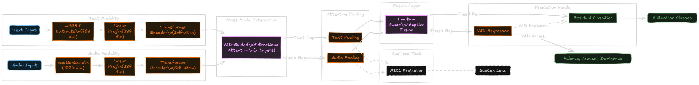

# Multilingual VAD-Guided Speech Emotion Recognition (SER)

This repository contains the implementation of a Multilingual Multimodal Speech Emotion Recognition (SER) system. The system leverages Voice Activity Detection (VAD) to guide attention mechanisms and employs a novel emotion-aware adaptive fusion strategy.

## 🌟 Key Features

- **Multimodal Architecture**: Fuses text (Multilingual BERT) and audio (`emotion2vec_plus_large`) features.
- **VAD-Guided Attention**: Enhances cross-modal interaction by focusing on speech-active regions.
- **Novel Components**:
  - **VADGuidedBidirectionalAttention**: Aligns audio and text representations using VAD cues.
  - **EmotionAwareAdaptiveFusion (EAAF)**: Dynamically weights modalities based on emotional content.
  - **MICL Projector**: Implements Supervised Contrastive Learning (SupCon) for better representation learning.
- **Robust Loss Function**: Combines Focal Loss (for class imbalance), VAD Regression Loss, and SupCon Loss.
- **Multilingual Support**: trained and tested on datasets like IEMOCAP (English), EmoDB (German), and EMOVO (Italian).

## 📁 Repository Structure

- `main.py`: Main training script for the ACL 2026 Enhanced model.
- `inference.py`: Script for performing inference on single audio files with text input.
- `models/`: Contains the model architecture definition.
  - `novel_components.py`: Implementation of VAD-Attention, EAAF, and MICL.
- `processing/`: Scripts to preprocess raw datasets (IEMOCAP, EmoDB, EMOVO) into pickle feature files.
- `metadata/`: CSV metadata files for the supported datasets.
- `evaluate_metrics.py`: Script for computing evaluation metrics.

## 🚀 Installation

1. **Clone the repository:**
   ```bash
   git clone https://github.com/yourusername/Multilingual-VAD-Guided-SER.git
   cd Multilingual-VAD-Guided-SER
   ```

2. **Install Dependencies:**
   Ensure you have Python 3.8+ installed. Install the required packages:
   ```bash
   pip install torch torchvision torchaudio --index-url https://download.pytorch.org/whl/cu118  # Adjust for your CUDA version
   pip install transformers librosa soundfile scikit-learn numpy funasr
   ```
   *Note: Use `funasr` for the `emotion2vec` model.*

## 🛠️ Data Preparation

Before training, you need to extract features from your raw audio datasets. Use the scripts in the `processing/` directory.

Example for EmoDB:
```bash
python processing/process_emodb.py --root_dir /path/to/EmoDB --output_dir features_common_6
```
*Repeat for other datasets (IEMOCAP, EMOVO) using their respective scripts.*

## 🏃 Usage

### Training

To train the model, use `main.py`. You can specify multiple datasets for training and validation.

```bash
python main.py \
  --train features_common_6/IEMOCAP_Common6_train.pkl features_common_6/EmoDB_Common6_train.pkl \
  --val features_common_6/IEMOCAP_Common6_val.pkl features_common_6/EmoDB_Common6_val.pkl \
  --epochs 100 \
  --batch_size 32 \
  --num_runs 5 \
  --output results.json
```

**Arguments:**
- `--train`: List of training pickle files.
- `--val`: List of validation pickle files.
- `--epochs`: Number of training epochs (default: 100).
- `--batch_size`: Batch size (default: 32).
- `--num_runs`: Number of independent runs for statistical significance (default: 5).

### Inference

To run the model on a single audio file:

```bash
python inference.py --audio path/to/audio.wav --text "The corresponding text transcript"
```

This will output the predicted emotion, confidence score, and VAD estimation values (Valence, Arousal, Dominance).

## 📊 Model Architecture



The model generally follows this flow:
1. **Feature Extraction**: 
   - **Audio**: `emotion2vec_plus_large` (1024-dim).
   - **Text**: `bert-base-multilingual-cased` (768-dim).
2. **Projection**: Linear layers project both to a shared `hidden_dim`.
3. **Cross-Modal VAD Attention**: Audio and Text attend to each other, guided by VAD scores.
4. **Pooling**: Attentive Pooling aggregates sequences.
5. **Fusion**: EAAF fuses the pooled representations.
6. **Task Heads**: 
   - **Emotion Classifier**: Predicts one of 6 classes (Anger, Sadness, Happiness, Neutral, Fear, Disgust).
   - **VAD Regressor**: Predicts continuous VAD values.

## 📈 Performance Results

 The model has been evaluated on three diverse datasets (IEMOCAP, EmoDB, EMOVO) in a multilingual setting. Below is the summary of the performance achieved:

 | Dataset | Language | Accuracy | Weighted F1 |
 | :--- | :--- | :--- | :--- |
 | **IEMOCAP** | English 🇺🇸 | **78.99%** | 79.14% |
 | **EmoDB** | German 🇩🇪 | **98.25%** | 98.24% |
 | **EMOVO** | Italian 🇮🇹 | **88.10%** | 87.58% |
 | **Global** | Multilingual 🌍 | **80.10%** | 80.25% |

 *Note: Results demonstrate the model's robustness across different languages and recording conditions.*

 ## 🤝 Contributing

Contributions are welcome! Please open an issue or submit a pull request for any improvements or bug fixes.

## 📜 License

[MIT License](LICENSE)
